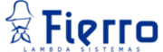

==================
Opiniones sponsors
==================

A continuación se presentan opiniones de varios de los sponsors del evento.

WingWare
--------

:homepage: http://www.wingware.com/

.. image:: opiniones_sponsors/wingware.png
    :align: center

We weren't there so I don't have much info about the conference itself.  As far
as our sponsorship, it was easy and painless (we were just a minor sponsor).
I can see that nobody used our 50% off discount code for Wing IDE Pro.
Can you confirm whether our 500 discount flyers were received and distributed
to the attendees? (N.del.E.: estos flyers se entregaron a todos los asistentes)

2 out of 3 of the free Wing IDE Pro licenses that were given away at the
conference have been claimed (it's still possible the third will be claimed as
well).

You sent opt-in marketing info which we haven't used yet.  I'm not sure if
we'll use it, but maybe to send out the discount code again to see if anyone
uses it.  FWIW yours is the only PyCon we've ever sponsored that did that.

I hope the conference went well!

Thanks,

Stephan Deibel
Wingware

Lambda Sistemas
---------------

:homepage: http://www.fierro-soft.com.ar/

Participamos como Sponsors de la PyCon y lo hacemos con mucha alegría
porque lo disfrutamos muchísimo cada año. La PyCon nos aporta una gran
experiencia tanto a nivel de empresa como personal.
Cada año volvemos de la conferencia con la energía renovada y millones
de ideas para poner en práctica.
La participación como sponsors la hacemos en la medida de nuestras
posibilidades y realmente con mucho gusto.
