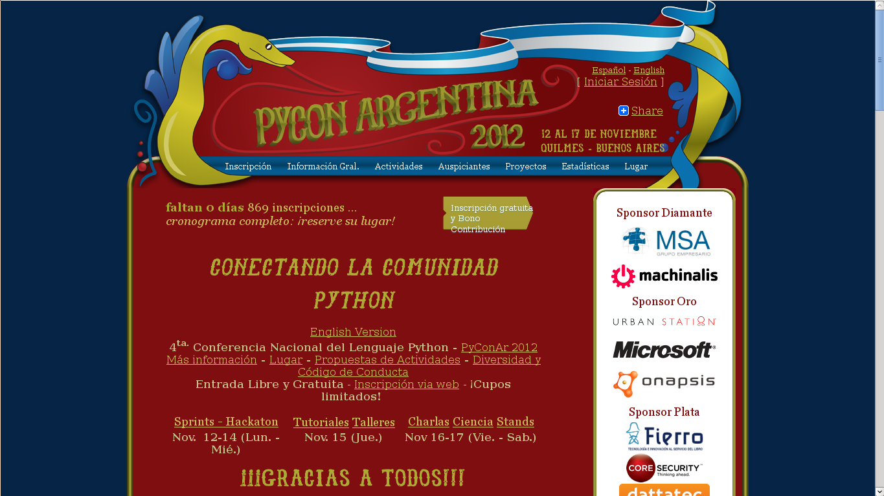

==================
Sobre el sitio web
==================

:Autor: Mariano Reingart
:Email: reingart@gmail.com

Sitio web de la conferencia: http://ar.pycon.org/2012

Tomamos muchas características de PyCon US y EuroPython, tratando de adaptarlas
para nuestra operatoria, costumbres y posibilidades.

Incluso simplificamos muchos aspectos como la registración y propuesta de
charlas (que comparativamente tienen menos pasos que los sitios mencionados).

Por los comentarios y discusiones, esto no fue percibido, y algunos de los
participantes solicitaron algo "más simple como en otros eventos" (como
EventBrite o similar).

El problema es que para un evento como PyCon Argentina (gratuito, con decenas
de disertantes y miles de potenciales usuarios), se complicaría manejarlo de
esa manera porque necesitamos algunas características (como la agenda
personalizada) para estimar mejor la asistencia, funcionalidades para las
búsquedas laborales (campos y CV, que ya son tradicionales y las hemos
ofrecido a los sponsors desde la primera conferencia), o temas adicionales
como la previsualización de certificados y credenciales (que no solo es un
tema visual, sino que también podría ayudar a mejorar y evitar algunos
inconvenientes que venimos teniendo),

    Sitio web de la conferencia

Por otro lado, tenemos recursos limitados y poca colaboración para esta
aplicación. En general, la cantidad de administradores/desarrolladores no
supera las dos personas  (desde 2009, ya sea en web2py o django), recibimos
pocos reportes de incidentes (menos de 10 en el sitio del proyecto) y menos
parches aún (1 solo este año). Incluso, el interés decrece sensiblemente
luego de que termina la conferencia, y se hace sentir cuando hay que actualizar
los sitios web anteriores para mantener un archivo histórico.
Obviamente es necesario modernizar la apariencia y navegación. Este año dimos
un primer paso respecto al diseño gráfico, y tuvimos una propuesta de una
empresa para mejorar el HTML que lamentablemente no se concretó.

Si bien muchos de estos temas pueden parecer accesorios y se podría
tranquilamente usar algún paquete "extranjero" o directamente un sitio
estático y recibir las charlas por mail, que sería parecería un retroceso, no
solo perderíamos la experiencia y trabajo de estos últimos 4 años
(comenzando desde 0 otra vez), sino que resultaría menos práctico, poco
transparente y hasta desprolijo.

Una última recomendación sobre este tema es no desarrollar el sitio web a la
par de la conferencia. Lamentablemente venimos con ese "modus operandi" desde
2009 (por falta de tiempo e intentos fallidos), haciendo ajustes sobre la
marcha, que si bien son necesarios para implementar las mejoras, también
causan cierta confusión de los usuarios menos experimentados y generan algunos
inconvenientes de estabilidad y performance.

Lo ideal sería tener todo definido y probado antes de comenzar con el llamado
a propuestas de charlas.
