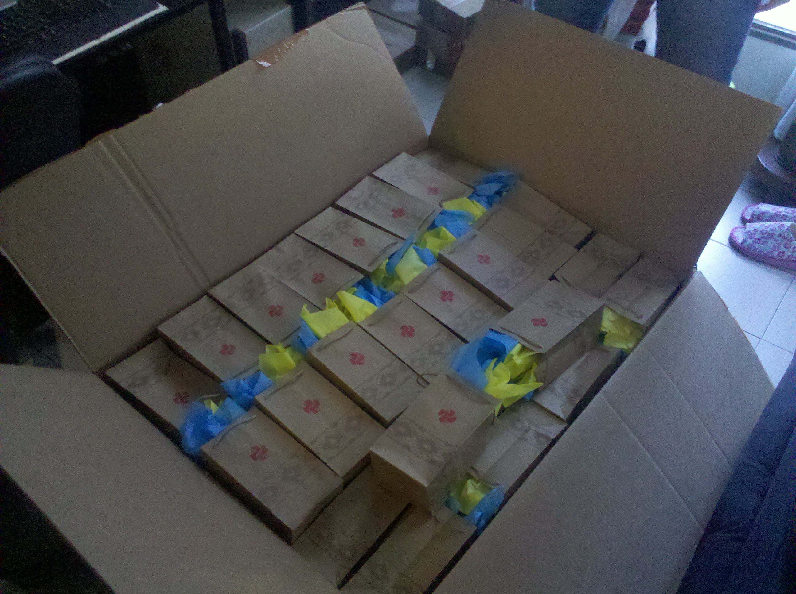

==============================================================
Aspectos financieros y administrativos de PyCon Argentina 2012
==============================================================

:Autor: Lic. Cra. Nadia Luczywo
:Email: nluczywo@gmail.com

La cuarta conferencia en lenguaje de programación Python, tuvo impactos en
distintos ámbitos y entre ellos ahora pasamos a desmenuzar la cuestión
administrativa-financiera.

En toda organización cuando se debe administrar fondos aparecen tres pasos:
planear y presupuestar, ejecutar y finalmente informar y tomar medidas
correctivas. Esto acompañó el desarrollo de la conferencia y ayudaron a
los administradores a hacer un manejo  acertado, dentro de lo posible, de los
fondos.

Etapa presupuestaria
---------------------

De forma temprana (enero/febrero del 2012) el equipo de organizadores contaba
ya con la información de los roles que tenían.  Esto posibilitó un tiempo de
análisis crítico evaluativo de presupuestos de años anteriores, que serían el
insumo base para la elaboración del presupuesto.

De esta etapa los datos más importantes recolectados son:

La edición  2009 tuvieron los gastos bastante detallados; pero a causa de la
inflación,  esta información era para “tomarse con pinzas”.

    - De la edición 2010 no conseguimos datos (N.del.E.: La planilla de gastos
      del 2010 fue entregada 4 meses después, cuando ya la organización estaba
      en marcha, por lo que fue desestimada en el proceso de estimación)
    - La edición a 2011   aportó sus números generales globalizados y agrupados;
      esto evito la posibilidad de evaluar que gastos contenía cada ítem que se
      presentaba.
    - Algo que hubiera sido importante que se registre en ediciones anteriores
      es la información de contacto de los potenciales sponsors. Esto es
      crítico para hablar con quien tiene decisiones sobre el manejo de capital
      en la empresa.

Con esta situación de  poca información respecto a cómo contactar a los
sponsors, incertidumbre inflacionaria, y extrema agrupación de los datos;
se emprendió el trabajo de presupuestación estimando los posibles ingresos y
egresos, manteniendo el compromiso de presupuesto flexible y con ajuste
permanente para que los datos fueran lo más reales que se pudo.

:Lo Bueno: La anticipación y flexibilidad del equipo a la hora de presupuestar.
:Lo malo:  Los escasos datos aportados por ediciones anteriores respecto a la
           información de contacto de  los patrocinadores y estimaciones de
           gastos.
:Lo feo:  Si bien es un agente externo; tener en cuenta que la inflación
          redobló los esfuerzos a enfrentar por parte del equipo en la
          actualización permanente de datos.

Etapa de ejecución
------------------

En esta etapa los principales aspectos fueron:

    - Hubo una permanente actualización de datos, la inflación impuso ese
      compromiso, tal como exponíamos en el punto anterior.
    - Dada la inflación  se trataron de ir anticipando la mayor cantidad de
      gastos siempre que se pudiera. Por ello  erogaciones como regalos de los
      disertantes, calcomanías y otros se hicieron hasta 6 meses antes.
    - Para cada gasto en particular se pedía cotización a varios proveedores.
    - Se compraron artículos para la conferencia tanto en Córdoba como
      Buenos Aires, debido a que se repartieron ciertas tareas entre el equipo
      de coordinadores que residía en esas provincias.
    - En lo que se refiere a ingresos, se fue depurando y actualizando
      la información de contacto. Muchos miembros de la comunidad colaboraron
      facilitando el contacto de los potenciales patrocinadores.
    - El ingreso de fondos en general fue escalonado y por ello hubo gastos
      donde la inflación marcó revancha en los precios abonados.
    - Las transferencias internacionales por patrocinio correspondientes a la
      PSF y a Microsoft demoraron en ingresar por controles adicionales
      impositivos y, consecuentemente,  la espalda financiera de  la
      Conferencia se vió afectada.
    - Solar, por su estructura organizativa, demoró el cumplimiento y pago
      con los proveedores, que generó ciertos desfasajes  y dificultades que
      debieron superarse en la etapa de ejecución.
    - Hubo momentos en que los  organizadores debieron cubrir los gastos de la
      conferencia por un lapso de tiempo hasta que ingresaron los fondos o Solar
      agilizara sus procedimientos para realizar pagos.
    - La falta de personería jurídica también fue un aspecto negativo, no sólo
      por la falta de rapidez en la realización de pagos, sino también porque
      en Solar encontramos discrepancias ideológicas a la hora de aceptar o
      rechazar a patrocinantes.
    - Los organizadores, al tener otras responsabilidades (no estaban dedicados
      full time a PyConAr), disponían de tiempos acotados para llevar adelante
      las tareas financieras y administrativas. A veces esta situación tuvo su
      costo extra para la conferencia porque no fue posible atender tan
      urgentemente algunos aspectos.
    - El rol de la secretaria con horario flexible fue invaluable; ya que
      ayudó a cumplir con muchas cuestiones operativas necesarias para la
      conferencia.

    Regalos para disertantes almacenados desde jun/2012 hasta nov/210

:Lo Bueno: Fue la anticipación de gastos para combatir la inflación, y la
           posibilidad de  contar con horario flexible de algunos miembros del
           equipo organizador para enfrentar cuestiones operativas.
:Lo Malo: El capital de trabajo que a veces fue negativo porque el ritmo de los
          ingresos era menor al de los egresos.
:Lo Feo: Por la falta de personería jurídica se vio acotado el poder de decisión
         de la organización en cuanto a la elección de patrocinadores y
         disposición de los pagos. Un sponsor se cayo culpa un poco de unos
         mails traspapelados y un poco mala voluntad del patrocinador en
         cuestión.

Etapa de  información y toma medidas correctivas
------------------------------------------------

Este post-mortem junto con el balance constituyen esencialmente esta etapa.

Las medidas correctivas propuesta para tratar de subsanar lo malo consiste en:

    - Brindar a los siguiente organizadores la base de datos de sponsor e
      información de contacto  obtenidas en esta edición.
    - Se confeccionará un balance general final de la conferencia que tenga el
      desglose de los gastos.
    - Se dejará un excedente de fondos detallados pertinentemente en el balance
      para subsanar los problemas en cuanto kick-off de la siguiente edición.
