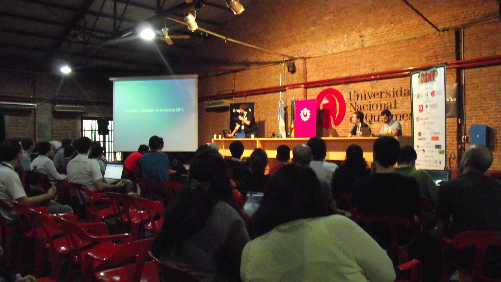
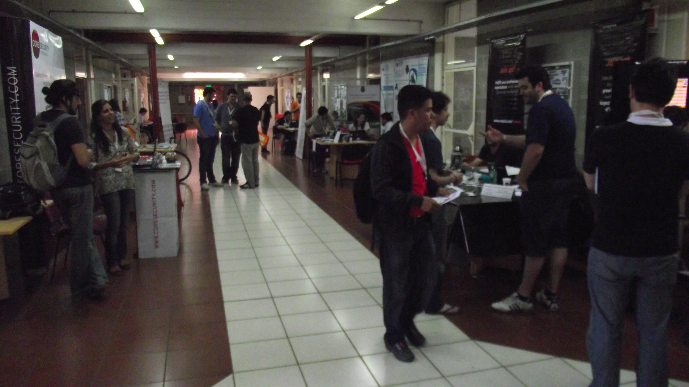

===============================================
En el frente de Batalla: Actividades On-The-Fly
===============================================

:author: Juan Pedro Fisanotti.
:email: fisadev@gmail.com

En el evento sucedieron varias actividades, que si bien a sabiendas que que
iban a suceder, por su naturaleza deberian ser planificadas y ejecutadas en
el momento de la conferencia.

Estas actividades eran:

**Ligtning Talks**: Esta actividad se realizan ambos dias
de la conferencia propiamente dicha (vier 16 y sab 17) luego de las
charlas programadas. Consisten en una presentación corta a elección del
disertante (y no necesariamente de Python), no mayor a cinco minutos. A
diferencia de las Charlas Programadas, no hay proceso de aprobación; los
oradores simplemente se anotan durante la PyCon en un papel disponible en la
registración. Este período rápido  orienta a los oradores a enfocarse en
lo esencial y proporciona a la audiencia unos diez temas durante una hora.

    Charlas relámpago del 16/11/2012

**Sorteos:**

**Stands y concursos de sponsors:**

:Lo Bueno:
    - Lightning talks: estuvo bien avisar en las aulas entre charla y
      charla que estaba la posibilidad de anotarse para las relámpago,
      para que la gente se entere y proponga. Los tiempos fueron respetados,
      salvo una excepción.
    - Sorteos: los premios de libros y descuentos en herramientas fueron
      algo interesante y novedoso, por lo general son solo remeras y
      merchandasing. La app con la foto creo que le dio un toque
      más entretenido, varios asistentes después comentaron que les gustó.
    - Stands y concursos de sponsors: Fomentó mucha interacción entre gente
      y empresas asi como charlas de pasillo, etc.

:Lo Malo:
    - Lightning talks: El papel donde se encontraban anotadas las charlas tendia
      a perderse. Es una mejor alternativa tener un pizarrón donde puedan
      anotarse las propuestas con comodidad y un cartel que cumpla la doble
      función de invitacion (a dar una charla relámpago) y también explique
      la operativa.
    - Sorteos: Fueron desordenados e improvisados. Hay que haber previsto con
      antelacion los siguientes puntos: premios, tiempo disponibles, los
      responsables y sus roles.
    - Stands y concursos sponsors: La ubicación no era la mejor durante el día
      viernes (separado de la registración). Hasta el momento del break,
      muchos asistente no percibieron los stands hasta el momento de break.

:Lo Feo:
    - Lightning talks: Falto aclaración en las reglas ya que un grupo trato de
      presentar mas de una charla que, a priori, parecian del mismo tema
      (Eran charlas distintas). Esto podria haber generado gente que se sienta
      ofendida, o en el peor de los casos, discriminada.
    - Sorteos: Falto una lista clara de premios y anunciar cual es el orden de
      los mismos; para que los asistentes entiendan cuando empieza y termina
      el sorteo.
    - Stands y concursos sponsors: Explicar mejor la operatoria a los sponsors
      al momento del armado stand ya que no se preciso en que momento se
      propondria a los asistentes a acercarse a su area de promocion.

    Hall de Sponsors en un momento tranquilo
