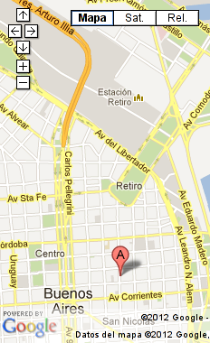

=========
Las Sedes
=========

:author: Juan B Cabral.
:email: jbc.develop@gmail.com

Este año PyConAr 2012 se realizo durante toda una semana (2012/11/12 al
(2012/11/17) por lo cual se designaron 2 sedes (y una de backup) para todo el
evento.

Urban Station: Sede Downtown
----------------------------

:Homepage: http://argentina.enjoyurbanstation.com

Urban station es segun su propia pagina de internet:

    ... el primer lugar diseñado especialmente para los
    trabajadores móviles y para todos aquellos que compartan la idea de que es
    posible trabajar o reunirse de otra manera.

    Este proyecto fue concebido con el objetivo de convertir a Urban Station en
    la primera red a nivel mundial para los trabajadores móviles.

    Combina:

        * Todos los servicios de una oficina para trabajar o reunirse.
        * Espacios flexibles para que te sientas cómodo.
        * Conectividad redundante y de alta velocidad.
        * Interacción con gente en tu misma sintonía.

    Nuestro sistema es muy simple:

    Entrás, elegís donde sentarte, te conectás, te servís lo que quieras del
    coffee break y sólo pagás por el tiempo que te quedás.

Así luego de varias negociaciones se decidió como sede de sprints workshops y
tutoriales el local Downtown de la franquicia que se encuentra en
*Maipú 547 - Microcentro - Buenos Aires*

    Ubicación de Sede Downtown de Urban Station.

Urban Station nos brindo:
    - 2 salas de reunion para 14 personas
    - 1 auditorio para 60 personas el dia Jueves
    - Los open spaces (lugares comunes de trabajo).

Además del café  libre durante todo el dia; para desayunos y meriendas nos
acercaron medialunas muy deliciosas las cuales eran preparadas en el mismo
local.

El día lunes iniciamos el evento con los sprint de desarrollo y se llenaron las
2 salas de reuniones. El Martes mientras se realizaba el "sub-evento" de PgDay
(http://www.pgday.com.ar/buenosaires2012/) continuaron los sprint
con mucho menos concurrencia así que solo se utilizó el salón mas grande.
Los días miércoles y jueves volvimos a tener un lleno total, sumando el jueves
el auditorio donde se realizaron los tutoriales.

Lamentablemente en el local tuvimos un corte de luz justo antes de la última
exposición de los tutoriales (el jueves) por lo cual movimos solo esta charla
a *Educacion IT* a media cuadra de Urban Station Downtown.

.. figure:: lasede/lasede_urban2.jpg
    :scale: 20 %
    :align: center

    Sala de reuniones mayor de Urban Station Downtown

:Lo Bueno: Las aulas, el aire acondicionado, las medialunas, la excelente
           predisposición de los dueños y empleados, el café y la ubicación.
:Lo Malo: Justo 3 días antes del evento hubo un paro de empleados de
          recolectores de basura y había un olor bastante feo en todo
          microcentro (esto no es propio de la sede pero hay que tenerlo en
          cuenta). El corte de luz que afectó a buena parte del microcentro nos
          retraso en la última disertación. El aire acondicionado del auditorio
          no funcionaba.
:Lo Feo: Tenemos un compañero de PyAr que esta en sillas de rueda y todo el
         local tiene escaleras y no esta preparado para discapacitados.

Universidad Nacional de Quilmes
-------------------------------

:Homepage: http://www.unq.edu.ar/

Los momentos fuertes de la conferencia (Las charlas del viernes y sábado) suelen
reunir una cantidad enorme de personas; por lo cual siempre las alternativas de
PyAr fueron las Universidades.

Este año, la universidad en cuestión fue la UnQui que se encuentra en
*Roque Sáenz Peña 352, Bernal Buenos Aires, Argentina (B1876BXD)*.

Nos brindaron un auditorio grande para mas de 200 personas y 3 aulas para
realizar los diferentes tracks en paralelo.

La sede cuenta con una muy completa solución para gente con problemas de
movilidad, baños limpios, cafeterías, y algunos locales comerciales alrededor
para comprar comida.

.. figure:: lasede/lasede_quilmes.png
    :scale: 100 %
    :align: center

    Universidad Nacional de Quilmes

Las autoridades del lugar se portaron excelente con la organización y no tuvimos
ni un problema de malentendidos.

En la elección de la sede la organización del evento (PyAr) se equivoco al
elegir un lugar fuera de Capital Federal, ya que recibimos varias críticas de
Porteños que se niegan a viajar Provincia (por lo discutido esto perece un
comportamiento común); esto es algo a tener en cuenta a futuro.

La asignación de aulas para cada charla fue tomada en base a la votaciones
de los inscriptos en la página del evento (las estrellas). La mayoría
fue bien distribuida, pero hubo casos donde no funcionó y hubo mas de 100 personas
en aulas preparadas para no mas de 30 sin aire acondicionado.

La distribución de las aulas en la facultad fue otro punto problemático, hay que
recordarles a las sedes que si están dispuestos a organizar un evento de la
magnitud de PyConAr deben estar dispuestos a poner las aulas a comodidad de las jornadas.
Las aulas, en definitiva, estuvieron extremadamente dispersas e incómodas para
ubicarlas por los asistentes, acompañado a esto durante algunas horas se
escuchaban ruidos molestos de construcciones mientras los disertantes hacían lo
suyo. Cabe aclarar que nos explicaron de problemas de logísta de aulas que tuvieron
pero aun así debe quedar registrado ya que con mas de 8 meses de planificación
esto se pudo haber evitado sin problemas.

El peor punto de la conferencia es un problema que tuvimos con una agrupación
política perteneciente a la UnQui (identificados con el color violeta), la cual
nos acusó de manera violenta de ocupar su espacio de militancia, aún cuando el
fin  de la conferencia era académico y científico y no político.
El incidente no paso a mayores, por intervención de autoridades de la universidad.
Se me informo que esta persona que nos vino a agredir ya tiene quejas
por que ha atacado a golpes a tanto hombres como mujeres.

.. figure:: lasede/grupal.jpg
    :scale: 65 %
    :align: center

    Foto grupal al cierre del evento en el auditorio de la UnQui

Por último sufrimos la sustracción de una netbook de un asistente, y de un banner
de la conferencia. Es recomendable que los siguientes eventos tengan un
guardarropa.

:Lo Bueno: La sede es un lugar calmado y cómodo a pocos minutos de Bs. As. El
           Auditorio es confortable y fresco.
:Lo Malo: La distribución de las aulas. La falta de coordinación de los
          organizadores con otras áreas (como construcciones).
:Lo Feo: La violencia política que demostró que existe dentro de la
         universidad.
